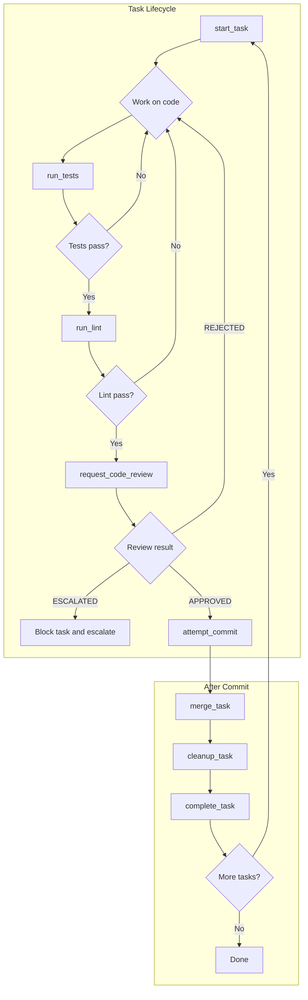

# Vibraphone

[](https://badge.fury.io/py/vibraphone)
[](https://pypi.org/project/vibraphone/)
[](https://opensource.org/licenses/MIT)
[](https://github.com/lukemcguire/vibraphone/actions)
[](https://codecov.io/gh/lukemcguire/vibraphone)

Vibraphone is an MCP (Model Context Protocol) server that enforces test-driven
development and code review for AI coding agents. It works with any
MCP-compatible agent (Claude, Cursor, Windsurf, etc.) to ensure code quality
through tooling rather than prompting.

## Why Vibraphone

AI coding agents are productive but undisciplined. They skip tests, ignore lint
failures, and commit without review. Prompting them to be careful works
temporarily, but agents forget as context fills and quality gates slip.

Vibraphone enforces quality gates through tooling:

- **Quality Gates**: Tests, lint, and LLM-powered code review must pass before
  any commit. The `attempt_commit` tool refuses to commit until
  `request_code_review` returns APPROVED.
- **Worktree Isolation**: Each task gets its own git worktree on a feature
  branch. Your main working directory stays clean.
- **Session Recovery**: If an agent session is interrupted, the next session can
  resume exactly where it left off.
- **Circuit Breakers**: After repeated failures on the same task, Vibraphone
  escalates instead of looping forever.

## Installation

```bash
# Install via pip
pip install vibraphone

# Or via uv (recommended)
uv tool install vibraphone
```

**Prerequisites:**

- Python 3.10+
- Git
- [beads_rust](https://github.com/lukemcguire/beads_rust) (`br` CLI) for task
  management
- An OpenAI-compatible API key for code review (set `OPENAI_API_KEY` environment
  variable)

## Quickstart (5 minutes)

### 1. Initialize Vibraphone in your project

```bash
cd your-project
vibraphone
```

When your agent connects, it will have access to `init_project`. Call it to
scaffold vibraphone files:

```
init_project()
```

This creates:

- `vibraphone.yaml` - Configuration file
- `AGENTS.md` - Agent behavioral contract (your agent should read this)
- `.mcp.json` - MCP server registration
- `docs/CONSTITUTION.md` - Coding conventions for code review
- `.planning/vibraphone/` - Governance documents including ARCHITECTURE.md

### 2. Create or import a task plan

**Option A: Using GSD (Get Shit Done) planning**

If you use GSD for project planning:

```
import_gsd_plan(phase_number=1)
```

This parses your GSD PLAN.md files and creates br issues for each task.

**Option B: Without GSD**

Create tasks directly with beads_rust:

```bash
# Create a task
br add "Implement user authentication"

# Or import from any markdown file with checkboxes
br import roadmap.md
```

Your agent can then use `next_ready()` to get the next available task.

### 3. Start a task

```
start_task(task_id="TASK-001")
```

This creates a git worktree, checks out a feature branch, and loads context for
the task.

### 4. Write code, verify quality

Follow the TDD loop:

1. Write a failing test
2. Run `run_tests()` - expect failure
3. Implement the feature
4. Run `run_tests()` - expect pass
5. Run `run_lint()` - fix any issues

### 5. Review and commit

```
request_code_review(paths=["src/my_feature.py"], stage_all=True)
```

This stages your changes and runs an LLM-powered review against your
CONSTITUTION.md. If issues are found, fix them and retry.

Once APPROVED:

```
attempt_commit(message="feat: add my feature")
```

### 6. Merge and cleanup

```
merge_task(task_id="TASK-001")
cleanup_task(task_id="TASK-001")
complete_task(task_id="TASK-001")
```

Your feature is now merged to main, the worktree is removed, and the branch is
deleted.

## How It Works



The quality gate tools (`run_tests`, `run_lint`, `run_format`) can be called at
any time during development. `attempt_commit` only succeeds after
`request_code_review` returns APPROVED.

## Workflow Examples

### Example 1: Feature Development with TDD

```
# Agent workflow
1. next_ready() -> get next task
2. start_task(task_id="TASK-042") -> worktree + context
3. # Write failing test
4. run_tests() -> fail (expected)
5. # Implement minimal code
6. run_tests() -> pass
7. run_lint() -> pass
8. request_code_review(paths=["src/"], stage_all=True) -> APPROVED
9. attempt_commit(message="feat: add user authentication")
10. merge_task(task_id="TASK-042")
11. cleanup_task(task_id="TASK-042")
12. complete_task(task_id="TASK-042")
13. # Back to step 1
```

### Example 2: Handling Review Rejection

```
1. request_code_review() -> REJECTED (issues: ["Missing error handling", "Hardcoded API key"])
2. # Fix the issues
3. request_code_review() -> REJECTED (issues: ["Still missing input validation"])
4. # Fix validation
5. request_code_review() -> APPROVED
6. attempt_commit(message="fix: add error handling and validation")
```

After `max_review_attempts` rejections, the tool returns ESCALATED. The agent
should then block the task and move on.

### Example 3: Session Recovery After Interruption

```
# Session was interrupted mid-task
1. recover_session() -> {"action": "resume", "task_id": "TASK-037"}
2. get_task_context(task_id="TASK-037") -> load context
3. # Continue where you left off
```

If the session was stale (task no longer in progress), recovery cleans up
automatically.

## Generated Files

When you run `init_project()`, Vibraphone scaffolds these files:

| File                   | Purpose                                                       |
| ---------------------- | ------------------------------------------------------------- |
| `vibraphone.yaml`      | Configuration for quality gates, worktrees, and review        |
| `AGENTS.md`            | Behavioral contract for AI agents (workflow state machine)    |
| `.mcp.json`            | MCP server registration for your agent                        |
| `docs/CONSTITUTION.md` | Coding conventions checked during code review                 |
| `docs/ARCHITECTURE.md` | Mermaid diagrams maintained by agents as architecture evolves |

The `ARCHITECTURE.md` file uses Mermaid diagrams to give agents a compressed
understanding of your system. Agents are expected to update these diagrams when
they change the architecture.

## Configuration

Vibraphone is configured via `vibraphone.yaml` in your project root:

```yaml
project:
  name: my-project
  version: 0.1.0

components:
  backend:
    language: python
    root: ./src
    test_command: pytest
    lint_command: ruff check .
    format_command: ruff format .

quality_gate:
  require_tests: true
  require_lint: true
  require_review: true
  max_test_attempts: 10
  max_review_attempts: 5

worktree:
  base_branch: main
  prefix: feat/

review:
  model: anthropic/claude-3-sonnet
  prompt_file: ./docs/prompts/reviewer.md
  constitution_file: ./docs/CONSTITUTION.md
```

See [docs/configuration.md](docs/configuration.md) for the full configuration
reference.

## Contributing

We welcome contributions! See [CONTRIBUTING.md](CONTRIBUTING.md) for guidelines.

### Development Setup

```bash
# Clone the repository
git clone https://github.com/lukemcguire/vibraphone.git
cd vibraphone

# Install dev dependencies
uv sync

# Run tests
pytest

# Run linting
ruff check .
```

## License

MIT License - see [LICENSE](LICENSE) for details.
